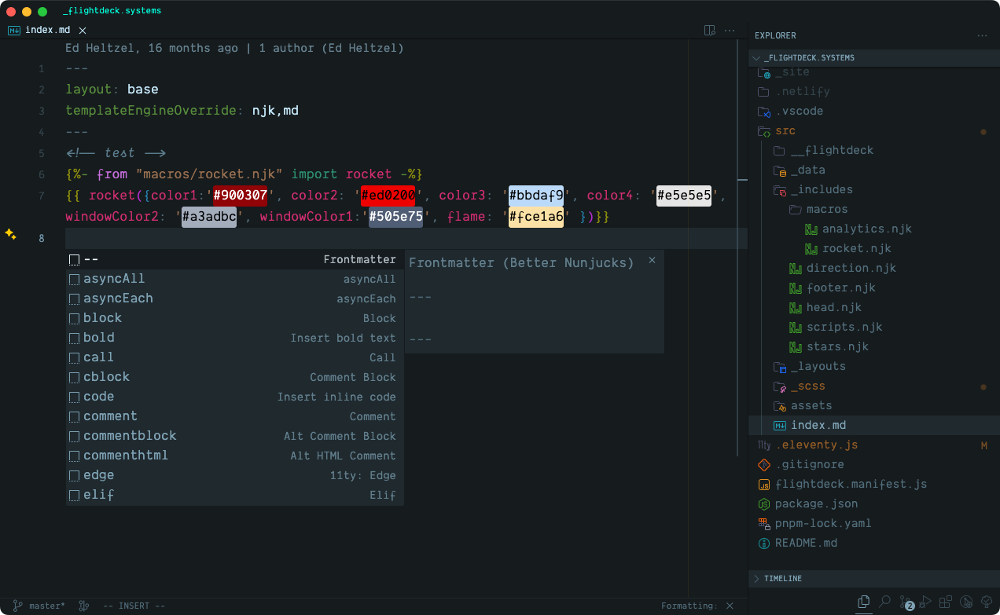
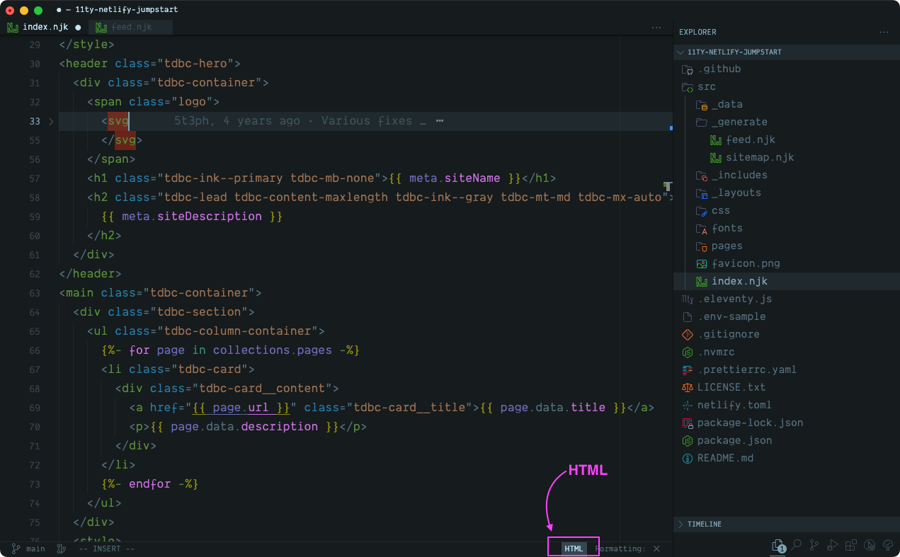
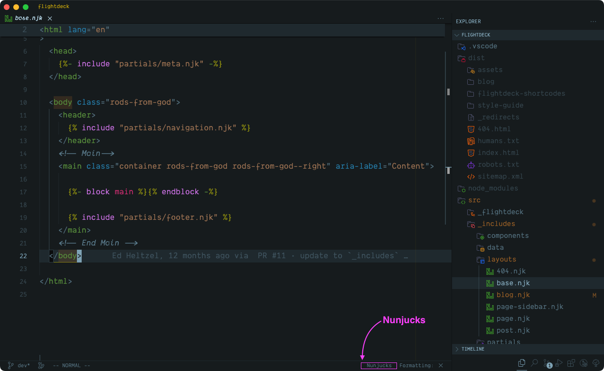
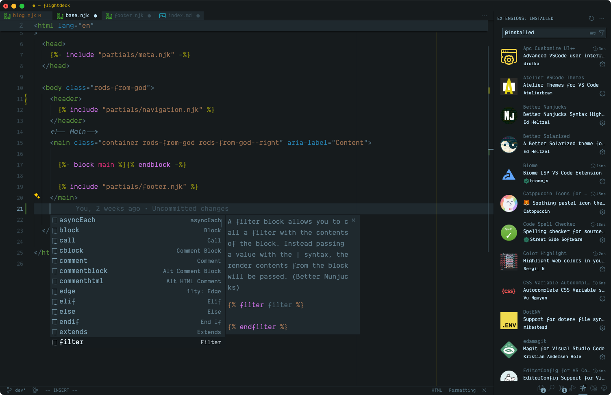
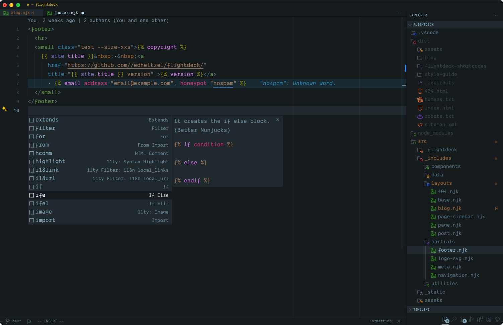

# Better Nunjucks Syntax and Snippets Extension for Visual Studio Code

## Syntax Highlighting:

For `.njk`, `.html`, and `.md` files the grammar is auto-detected.
All `.njk` files will default to `html` and provide syntax highlighting for Nunjucks tags, filers, and variables which are injected into the default `html` grammar. This attempts to keep the developer experience (DX) as simple as possible, without having to configure global or workspace settings with `files.association`. Hopefully this will provide the least amount of friction between other extensions that support Markdown or HTML.
<br>
<br>

|  |
|:--:|
| <strong>Nunjucks inside of Markdown + frontmatter support</strong>|

|  |
|:--:|
| <strong>Complex example of Nunjucks inside of HTML + frontmatter support</strong>|

|  |
|:--:|
| <strong>Nunjucks inside of HTML + frontmatter support</strong>|

|  |
|:--:|
| <strong>Using Nunjucks with Eleventy + frontmatter support</strong>|

|  |
|:--:|
| <strong>Using the Nunjucks grammar also support highlighting and frontmatter</strong>|

## Snippets:

The snippets are a combined fork of other Nunjucks snippet extensions but is extended to include all of Nunjucks built-in tags and provide support for multiple file extensions – `.njk`, `.html`, & `.md`

The reason for the fork is to avoid conflicts and behavior issues when editing `njk`, `html`, and/or `md` files or when altering `files.association`

> Note: If you would rather not use the snippets provided in this extension, no worries - I highly recommend installing [Control Snippets](https://marketplace.visualstudio.com/items?itemName=svipas.control-snippets) to enable or disable VS Code's built-in or manually installed snippets.

<br>
<br>

|  |
|:--:|
| <strong>Nunjucks Snippets in Markdown 😍</strong>|

|  |
|:--:|
| <strong>Nunjucks Snippets in HTML 😍</strong>|

|  |
|:--:|
| <strong>Nunjucks Snippets in Nunjucks 😊</strong>|


## Known Issues

One "gotcha" is code folding support. You will need to include the below to enable code folding for Nunjucks tags:

```json
//"_comment": "add this to your Global or Workspace settings.json"
"editor.foldingStrategy": "indentation"
```


When selecting the `nunjucks` grammar, enabling support for emmet is provided though the editor or the workspace settings:

```json
  "emmet.includeLanguages": {
    "md": "html",
    "njk": "html",
  },
  "emmet.syntaxProfiles": {
    "md": "html",
    "njk": "html",
  }
```

## TODO

- [X] Document how code folding works
- [X] Write about syntax injection with Auto detect
- [X] Setting `nunjucks` grammar and changes from auto-detect
- [X] Need images of syntax
- [ ] Add more support for custom tags and filter (syntax)
- [ ] Add all built-in filers to snippets
- [ ] Add built-in variables to snippets
- [ ] Add support of [Eleventy](https://www.11ty.dev/)
  - [ ] detect if `.eleventy.js` is available

